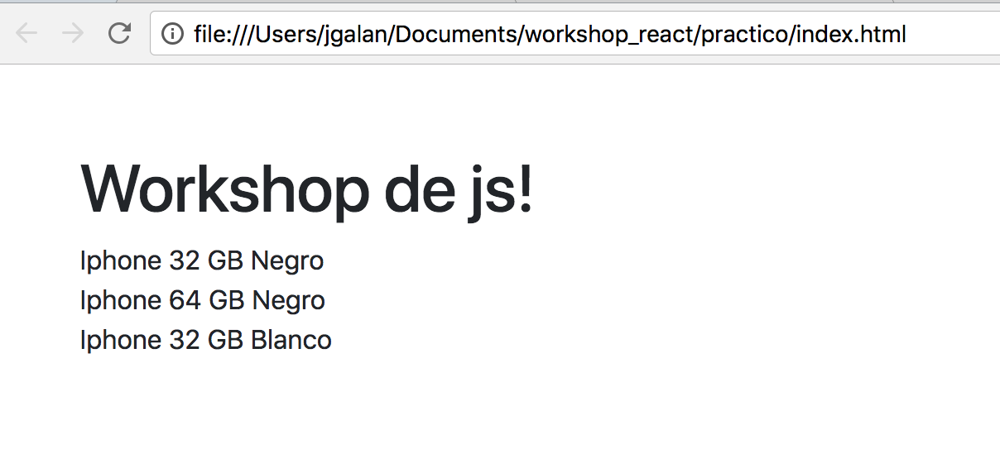

# Workshops JS - Práctico!

Bienvenidos a los ejercicios Prácticos del workshop!

Para comenzar a trabajar con ellos, te recomendamos descargar este repositorio!

## ¿Qué estaremos haciendo?
Durante el workshop, vamos a estar creando un listado de productos publicados en Mercado Libre!

Vamos a estar viendo paso a paso cómo armar esta aplicación, cómo diseñarla y como crear componentes para que sea más mantenible y escalable.

Y a lo largo del workshop, vamos a estar iterando sobre el ejercicio, agregando y codificando cada una de las features que vamos viendo durante el workshop.

## ¿Por dónde comenzamos?
Los archivos actuales que se encuentran en este repositorio son:
 - index.html: punto de entrada del proyecto. incluye actualmente las siguientes referencias:
    - React 16
    - React DOM 16
    - Babel
    - Bootstrap css
 - base.css: hoja de estilos base para la aplicación
 - data/items.js: datos de items de ejemplo

Para abrir la aplicación, solo tienes que hacer click en index.html y abrirlo con tu browser de preferencia. Recomendamos que uses Chrome debido a las facilidades que tiene el browser para hacer debugging.

Cuando hagas click en index.html, deberías ver lo siguiente:

