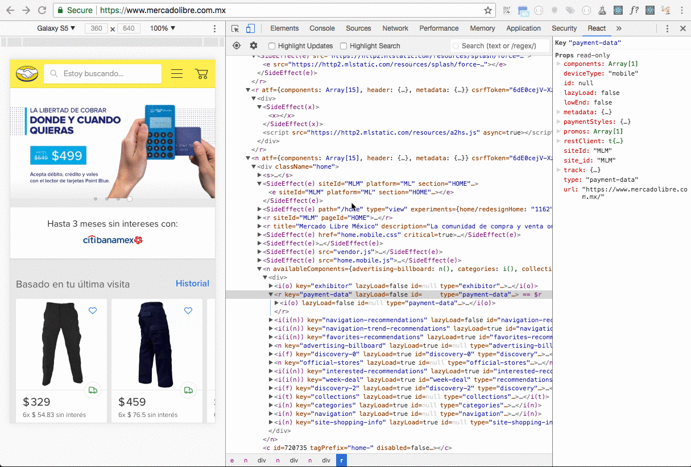

# 🛠️ Tips y experiencias

Para concluir este workshop, nos gustaría contarte un poco la experiencia que hemos tenido con react, y algunas cosas que nos gustaría comentarte para que las tengas en cuenta.

## Server side Rendering

React permite renderizar markups estáticos, lo cual es realmente útil si queremos que el procesamiento y el render de los componentes lo realice el servidor y que no sea un esfuerzo extra para el cliente hacerlo. Si nuestro servidor puede realizar ese procesamiento previo por nosotros, ganaremos en performance y daremos una mejor experiencia de usuario.

Para hacer uso de esta feature recomendamos usar Node JS, un server completamente en JS, que les va a permitir realizar esto sin mucho esfuerzo. Principalmente existen dos métodos importantes de react que están involucrados en esta feature:

* renderToString: permite convertir un componente en HTML estático.
* hydrate: se utiliza desde el lado del cliente, para dar vida al markup generado desde backend. Básicamente este método lee el Markup generado, y agrega los eventos necesarios, ya sea eventos de lifecycle o callbacks.

React al ejecutar hydrate, valida que Markup generado sea el mismo tanto en el server como en el client. En caso de que no lo sean, nos alertará, en ese caso lo deberíamos tomar como un error.

Para aprender un poco más de estas cosas, podés seguir estos links:

* [renderToString](https://reactjs.org/docs/react-dom-server.html#rendertostring)
* [hydrate](https://reactjs.org/docs/react-dom.html#hydrate)



## React dev tools

Encontrar errores y analizar aplicaciones hechas con react puede parecer sencillo cuando leemos los componentes en el código, pero a la hora de ver estos componentes funcionando en el cliente, no es tan sencillo ver en donde comienza un componente y termina otro. Tampoco lo es debuguear que props recibe un componente. Obviamente podemos hacer uso del console.log, pero existe una alternativa.

{% embed data="{\"url\":\"https://github.com/facebook/react-devtools\",\"type\":\"link\",\"title\":\"facebook/react-devtools\",\"description\":\"react-devtools - An extension that allows inspection of React component hierarchy in the Chrome and Firefox Developer Tools.\",\"icon\":{\"type\":\"icon\",\"url\":\"https://github.com/fluidicon.png\",\"aspectRatio\":0},\"thumbnail\":{\"type\":\"thumbnail\",\"url\":\"https://avatars0.githubusercontent.com/u/69631?s=400&v=4\",\"width\":400,\"height\":400,\"aspectRatio\":1}}" %}

React dev tools es una extensión de chrome y firefox que permite analizar las jerarquías de los componentes react, así como también debuguear las props que reciben estos componentes.

## Performance

Usualmente las aplicaciones desarrolladas con react son rápidas de por sí, pero cuando estas comienzan a escalar, puede que sea necesario realizar algunos ajustes para ganar en performance y usabilidad. Aquí les dejamos algunos criterios y consejos que pueden resultar útiles.

### Usar shouldComponentUpdate 

Este método del ciclo de vida es muy importante en este aspecto, ya que nos permite controlar cuando el componente necesita actualizarse y ejecutar el render. 

Cuando utilizamos React.Component, **este método devuelve por defecto true**, por lo cual cualquier cambio en el state o en props va a causar un render del componente. En caso de que tengamos props o variables en el state que no impactan en el render del componente, podemos implementar este método y hacer la evaluación del state o de las props para evitar actualizaciones innecesarias. 

Otra alternativa es hacer que las variables que estamos guardando en el state pero que no afectan al render, pasen a estar a nivel de clase, y de esta manera evitamos el rerender en caso de que se actualicen.

### Pure Components

De la misma manera que exportamos React.Component, podemos hacer uso de React.PureComponent. La diferencia entre estos tipos de componentes es que PureComponent implementa automáticamente shouldComponentUpdate, y realiza una comparación shallow de las props y del state. Utilizando PureComponent si nuestro componente recibe nuevas props o cambios en el state pero sus valores no cambian, no actualizará la UI.

Para aprender más y con ejemplos reales de sobre optimización de performance, pueden leer el siguiente artículo escrito por el equipo de AirBnb:

{% embed data="{\"url\":\"https://medium.com/airbnb-engineering/recent-web-performance-fixes-on-airbnb-listing-pages-6cd8d93df6f4\",\"type\":\"link\",\"title\":\"React Performance Fixes on Airbnb Listing Pages\",\"description\":\"There may be low-hanging fruit 🥝 affecting performance in areas you might not track very closely but are still important.\",\"icon\":{\"type\":\"icon\",\"url\":\"https://cdn-images-1.medium.com/fit/c/304/304/1\*MlNQKg-sieBGW5prWoe9HQ.jpeg\",\"width\":152,\"height\":152,\"aspectRatio\":1},\"thumbnail\":{\"type\":\"thumbnail\",\"url\":\"https://cdn-images-1.medium.com/max/1200/0\*ZPHyNBzpm6oT1dqu.\",\"width\":1148,\"height\":515,\"aspectRatio\":0.44860627177700346}}" %}

### ESLINT

### 

