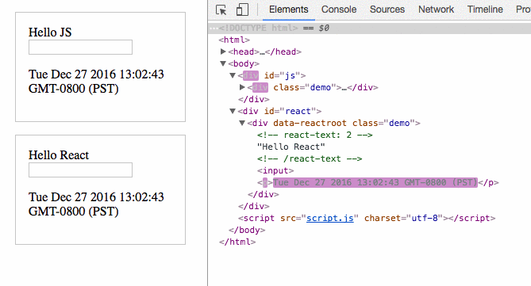

# 🔮 Virtual dom

## Introducción

Una de las operaciones más costosas en el mundo client-side es la actualización del DOM cuando se hacen cambios o cuando hay alguna interacción por parte del usuario. Esto se debe a que para realizar un cambio, el browser debe hacer:

1. Parsear el HTML para generar el DOM
2. Buscar el elemento a actualizar dentro de ese DOM
3. Actualizarlo
4. Aplicar CSS al elemento y a todos sus hijos
5. Hacer cálculos en lo que respecta al layout, distancias, y posiciones de los elementos

También esto implica que en caso de que una sola actualización pueda impactar a muchos elementos en la página.

## Virtual DOM

Virtual DOM es una representación en memoria del DOM de una página. Este Virtual DOM es manejado por react y permite evaluar los cambios que se han realizado sobre el DOM en una etapa previa, en donde se evalúan dichos cambios, corriendo ciertos algoritmos de diff, lo que permite marcar que elementos necesitan una actualización, para luego actualizar directamente esos elementos, además de identificar la menor cantidad de pasos necesarios para aplicar esas modificaciones.

El proceso de actualización del DOM se llama reconciliación, y el algoritmo puede ser un poco complejo, si te interesa saber un poco más del tema, puedes ver la documentación oficial:



